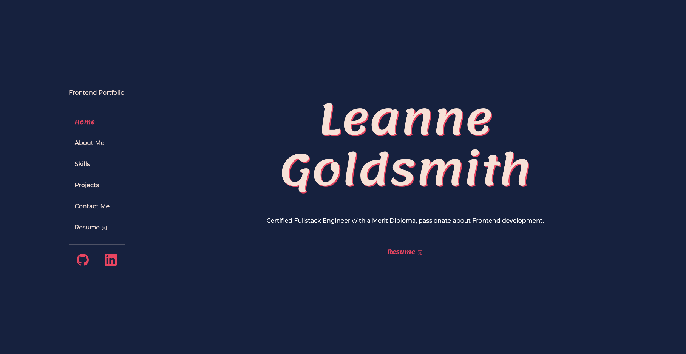

# Frontend Portfolio

A ReactJS portfolio website showcasing my projects, highlighting my skills, and providing a convenient way for users to reach out with any questions they may have.

## Application Appearance

View portfolio [here](https://leannecodes.github.io/react-portfolio/)

## Techstack
- ReactJs
- HTML
- CSS
- Bootstrap
- JavaScript
- Cloudinary

## Credits
- Path name for navlinks - [Source](https://reactrouter.com/en/main/components/nav-link)
- EmailJs - [Source](https://www.youtube.com/watch?v=bMq2riFCF90)
- View PDFs - [Source](https://www.geeksforgeeks.org/how-to-open-pdf-file-in-new-tab-using-reactjs/)
- Vite docs for setup and deployments - [Source](https://vitejs.dev/guide/)
- YouTube tutorials for switching side navbar to mobile-top navbar